#  — Play Mastermind 1v1 or vs AI, powered by Genetic & Five-Guess algorithms

<sub>🗓️ Developed in June 2023</sup>

This project is an implementation of the well-known game **Mastermind**, developed following the **three-layer architecture** design pattern (**Presentation**, **Domain**, and **Persistence** layers).  
Play Mastermind 1v1 or vs AI, powered by Genetic & Five-Guess algorithms.

---

## ✅ Features

- **Domain logic** with Five-Guess & Genetic algorithms to solve the game.
- **Persistence layer** for storing data.
- **Presentation layer** for interacting with the user using **GUI Swing**.
- **Three-layer architecture** strictly separating concerns (Presentation, Domain, Persistence).
- **JUnit test suite** with drivers for algorithm verification.  

---

## 🛠 Installation & Setup

### 0. Prerequisites
Make sure you have installed:
- **Java 11** or higher (JDK)
- **GNU Make** (to run the Makefile commands)

You can check your versions with:
```bash
java -version
make --version
```

### 1. Clone the repository

```bash
git clone https://github.com/marcturu/mastermind-game.git
cd mastermind-game
```

### 2. Compile or execute the program  

Navigate to `/FONTS/` and use the provided **Makefile** commands:

```bash
# Recompile all Java files
make executable

# Run the program from the precompiled JAR
make executar
```

The program uses the `--add-opens java.base/java.time=ALL-UNNAMED` flag for Java module access.

### 3. Use the `/DOCS/User Manual.pdf` to learn how to play.

---

## 🧪 Running Tests

JUnit test cases are provided for all major classes.  
However, these are **designed to run on Linux/macOS environments** due to differences in classpath handling and file encoding on Windows. If you are using Windows, you may encounter compilation errors with JUnit or encoding issues.

```bash
# Run all tests
make allTest

# Run a specific test
make TestRecord
make TestRecordInteger
make TestRecordDouble
make TestRecordLong
make TestRanking
make TestPartida
make TestRonda
make TestSequencia
make TestUser
make TestUser_maquina
make TestUser_persona
```

You can also run **driver_algorisme** to test algorithm-specific code (works on all environments):

```bash
make driver_algorisme
```

---

## 📂 Files

The project is organized into the following directories:

### `/lib`
Contains all required external Java libraries:
- `byte-buddy-1.12.16.jar`
- `byte-buddy-agent-1.12.16.jar`
- `gson-2.8.5.jar`
- `hamcrest-core-1.3.jar`
- `junit-4.12.jar`
- `mockito-core-4.9.0.jar`
- `objenesis-3.3.jar`

### `/EXE`
Contains compiled **JAR** files and output data.

### `/FONTS`
Contains the **source code**, the **Makefile**, and all **test cases**.

### `/DOCS`
Contains all project documentation, organized by delivery:

#### 📦 1st Delivery
- **Use cases**
- **Conceptual model diagram**
- **Data structures and algorithms used** (*Five Guess* algorithm)

#### 📦 2nd Delivery
- **Presentation layer**
- **Domain layer**
- **Persistence layer**
- **Data structures and algorithms used** (*Genetic Algorithm*)

#### 📦 3rd Delivery
- **User manual**
- **Test cases**

---

## 📷 Screenshots  

### Main:
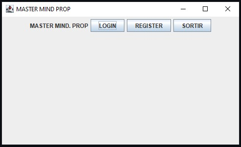
-
### Register:
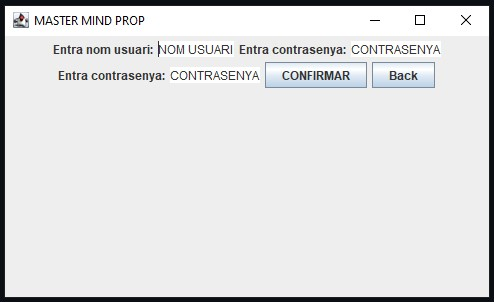
-
### Login:
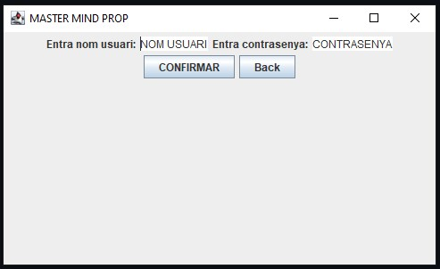
-
### Main Menu:
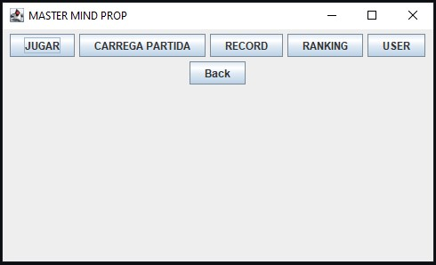
-
### Play - Configurations:
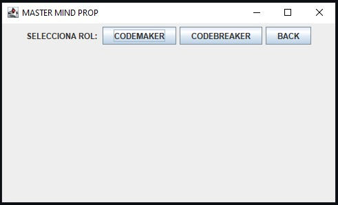

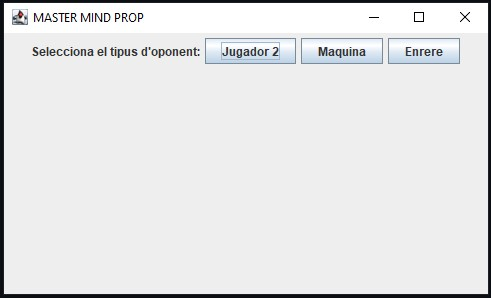

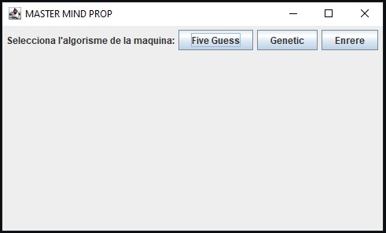

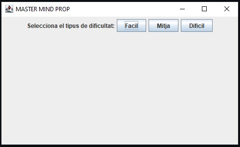
-
### Load Game:
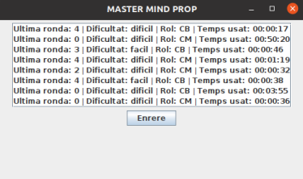
-
### Record:
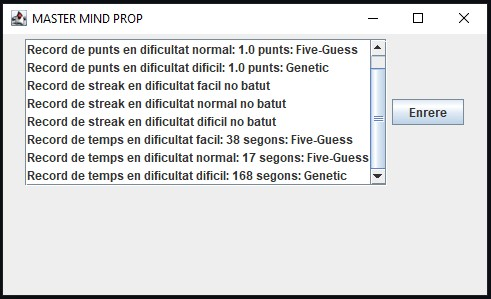
-
### Ranking:
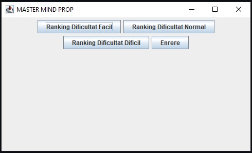

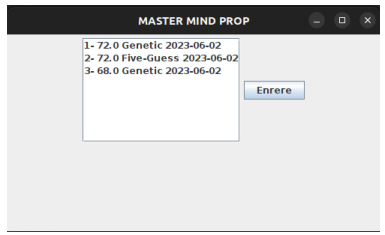

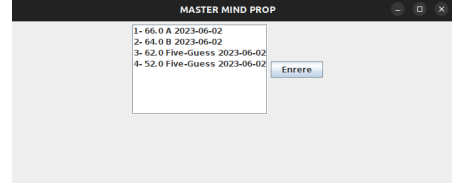

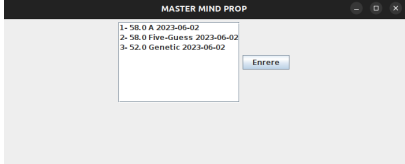
-
### User:
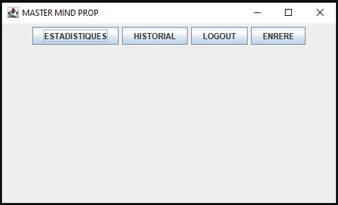

#### Stats:
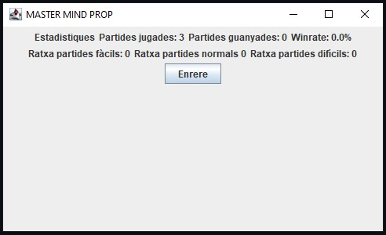

#### Hisotry:
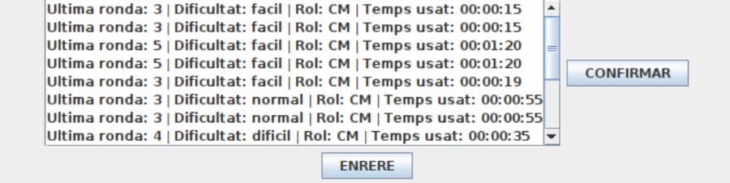
-
### Game:
##### Example of the start of a game as Codemaker against the Genetic machine
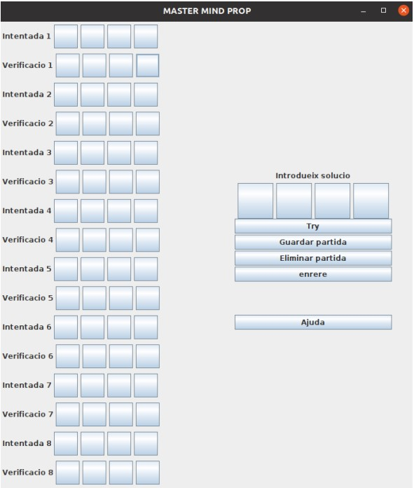

##### Example of the end of a game as Codemaker against the Genetic machine
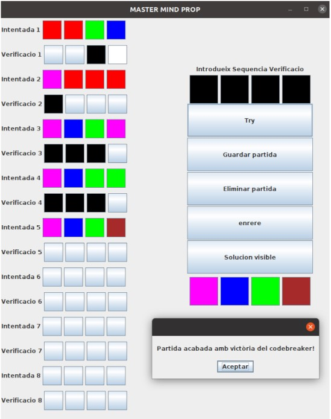
-
### Additional panels
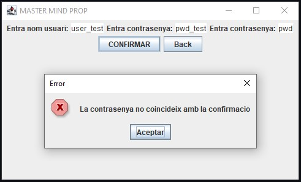

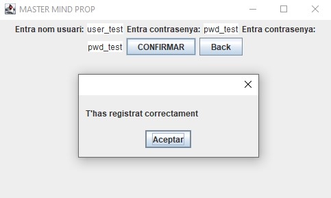

---
### Use Cases Diagram:
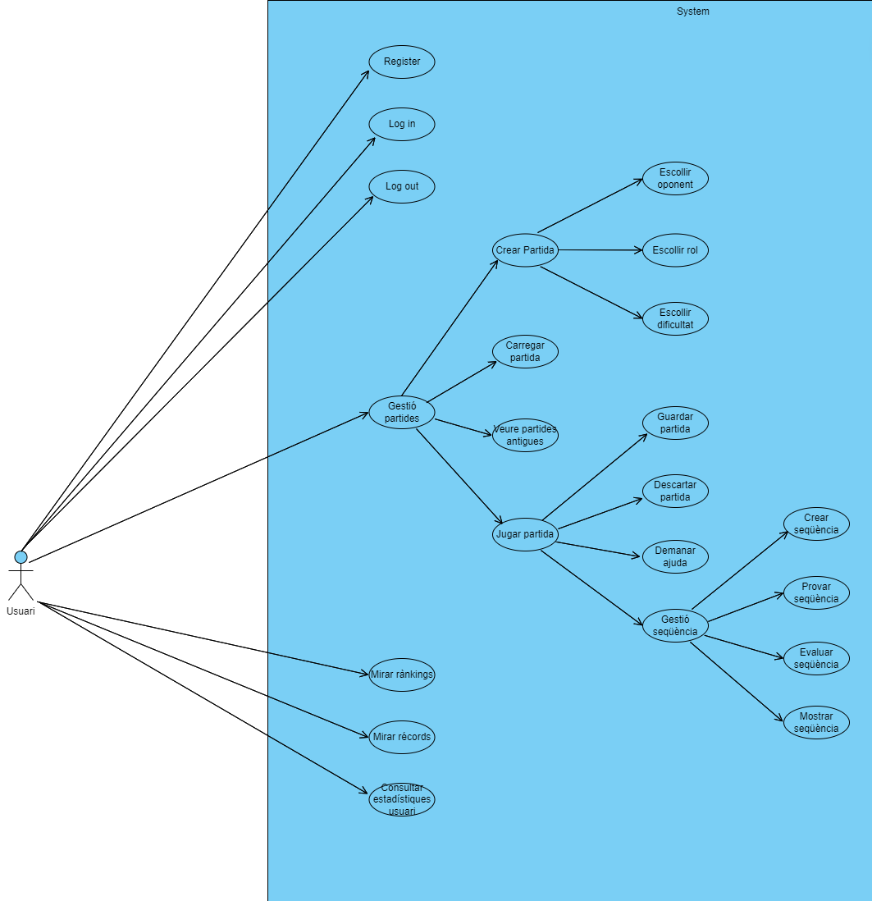

### UML Diagram:
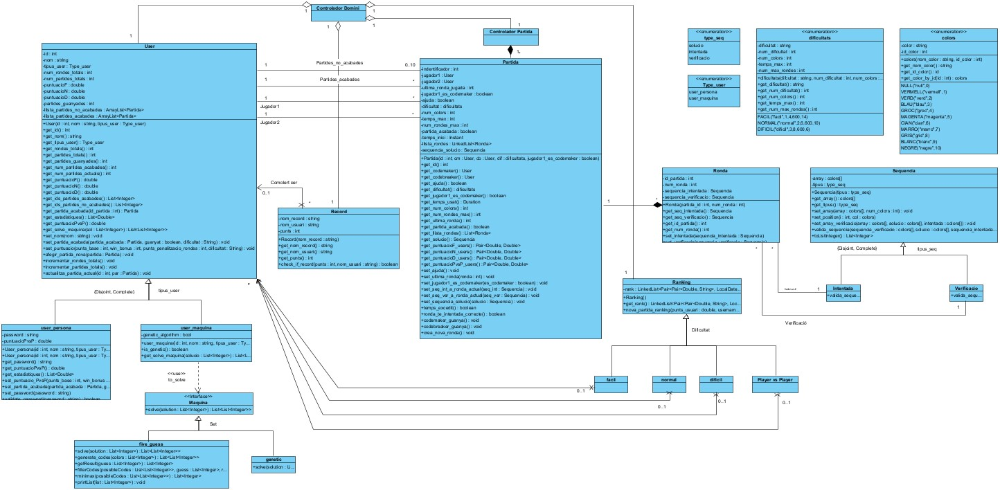

### Presentation Layer:
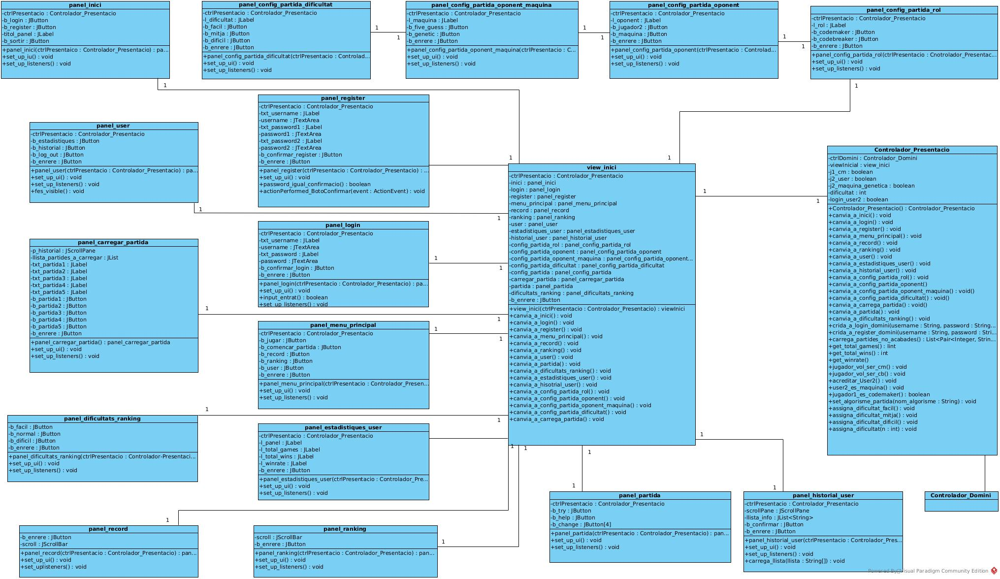

### Domain Layer:
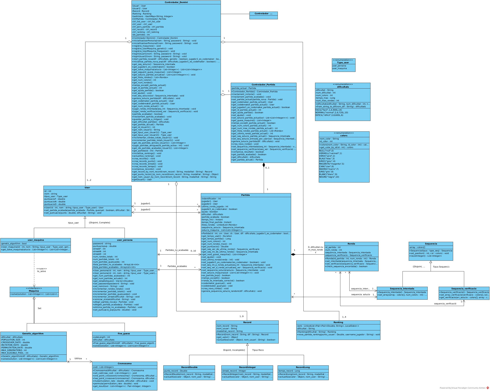

### Persistence Layer:
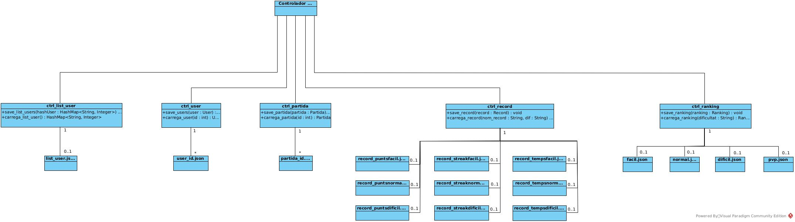

---

## ⚖️ Copyright & License

© 2023 Marc Turu Roca and collaborators. All rights reserved.  
This project is the joint intellectual property of its authors.  
No part may be copied, modified, distributed, or used without prior written permission from all authors.  

- Ferran Solanes Serrat  
- Jordi Baranda Dominguez  
- Juan Clusellas Cánova    
- Marc Turu Roca


